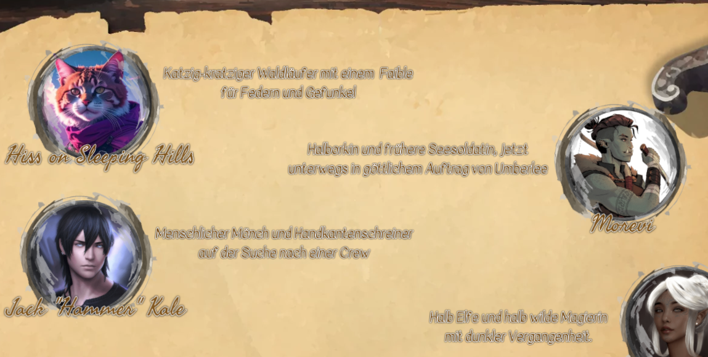
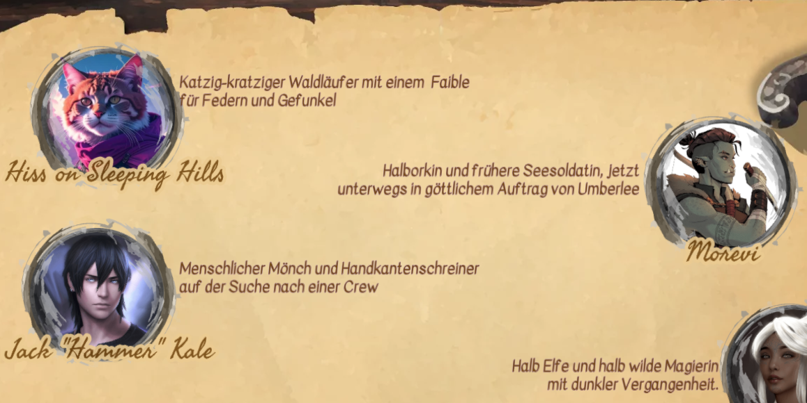

# More Text Options (Foundry VTT Module)

This module adds some configuration options for text drawings, like configuring the stroke color. It uses options supported by [pixi.js TextStyle class](https://pixijs.download/dev/docs/text.TextStyle.html).

This module is based on the [Advanced Drawing Tools](https://github.com/DawidIzydor/advanced-drawing-tools) module which does not support Foundry v14 yet. "More Text Options" is basically a code snippet taken from this this module with a few additional fixes. Since the text formatting is the only part I really needed, I decided to fork that part of the code.

All the code credits really belong to the original authors of the "Advanced Drawing Tools" module:

- [dev7355608](https://github.com/dev7355608)
- [Dawid Izydor](https://github.com/DawidIzydor)

## Installation

https://github.com/neovatar/more-text-options/releases/latest/download/module.json

See [Foundry Wiki - How to install a module](https://foundryvtt.wiki/en/basics/Modules) on help on how to use the manifest URL to install a module.

## Example

This text drawing from one of my campaigns was the main motivation for this module.

Basic Foundry text drawing rendering:

Rendering with configurable text stroke via "More Text Options":

